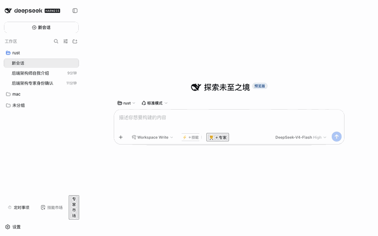

# @weibaohui/experts-management

[](https://github.com/topics/dsh-plugin)
[](https://www.npmjs.com/package/@weibaohui/experts-management)

**专家管理插件**：管理 ntd 格式的专家与专家团队（单个专家 / 多人团队），浏览安装 50+ 内置专家；每个专家注册为「仅用户可调用」的技能，在对话输入框输入 `/expert-名称`（或点 composer 工具行的「＋专家」按钮）即可以该专家的身份执行任务。



## 核心功能

- **内置专家**：ntd-resource 仓库的 `experts/` 子树经 git **稀疏检出**（只拉专家目录，不拉 400MB+ 的技能库），按来源分组浏览、搜索、详情预览、一键安装
- **用户库管理**：专家装到 `$DSH_HOME/experts`（插件的唯一内置来源，不读取 ntd 应用的任何目录）；其他目录可经 `extraSources` 配置显式纳入
- **团队专家**：完整支持 `expertType: team`——负责人 + 成员列表 + 各自头像；注入时使用负责人的角色定义（对齐 ntd 行为）
- **角色注入**：每个专家在宿主技能注册表里是一个 `disable-model-invocation` 语义的技能——不进模型目录（零 token 污染），仅保留 `/expert-名称` 用户手势；发送消息时宿主确定性注入完整角色定义 + 关联技能清单（链接指向 SKILL.md，模型按需加载）
- **输入框 ＋ 专家**：composer 工具行新增「＋ 专家」按钮，弹出带搜索框的专家候选浮层——专家/专家团分两个 tab（计数跟随搜索过滤）、各自按显示名排序，行内展示显示名与 `expert-名称` 字面量（👥 标记团队）；支持键盘 ↑/↓/Enter/Esc，选中即把 `/expert-名称` 写入草稿，发送时该专家的角色定义注入该条消息
- **专家详情**：角色定义全文、关联技能、团队成员、快捷指令、plugin.json 原文、文件清单与体积
- **内置自动同步**：与技能市场同款管线——clone `--depth 1 --filter=blob:none --sparse` + 每日 fetch/reset，支持 GitCode 私有仓库 access token（只写不回读）

- **编辑已安装专家**：角色定义（Agent MD）全文编辑、元数据表单（显示名/职业/描述/标签/快捷指令/默认开场，中英双语）、关联技能管理（从技能库复制副本进专家、移除仅删专家副本）、头像上传——仅「我的」（用户库）专家可编辑，内置只读；保存即生效

## 安装

```bash
dsh plugin --profile web add @weibaohui/experts-management -w
```

装完重启 `dsh web` 即生效。

## 使用

1. 打开 Web UI → **设置** → 左侧「专家管理」section 即完整管理页（可搭配 dsh-settings-ui 插件把设置窗口调大/全屏）
2. 「内置」视图浏览/搜索/安装专家（内置检出在插件自己的目录，不碰 ntd 应用）；「我的」视图管理用户库
3. 详情页可预览角色定义全文、团队成员、关联技能与 plugin.json
4. 对话时点输入框工具行的「＋ 专家」按钮（可搜索；或直接输入 `/expert-backend-architect`），该专家的角色定义即注入本轮对话
5. 内置页工具行的「内置设置」里可配置仓库地址、分支、access token、稀疏检出目录与自动同步

## 专家定义格式（WorkBuddy 兼容）

```
~/.dsh/experts/backend-architect/
├── .codebuddy-plugin/plugin.json   ← 入口定义（name/expertType/displayName/skills/…）
├── agents/backend-architect.md     ← 角色定义（YAML frontmatter + 正文）
├── skills/fullstack-dev/SKILL.md   ← 关联技能
└── avatars/expert.png              ← 头像
```

## 开发

```bash
npm install
npm run check        # 语法检查
npm test             # node --test
npm run build:client # 生成 client/bundle.js
```

## 联系我 :飞书群


